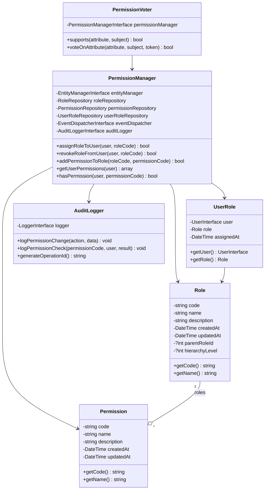
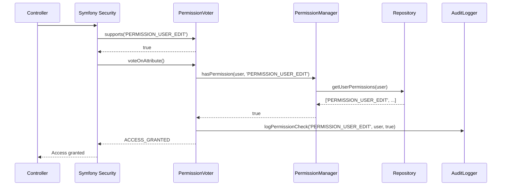
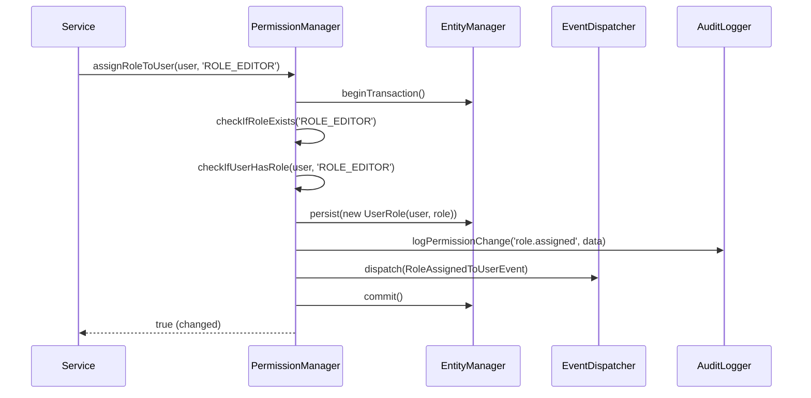
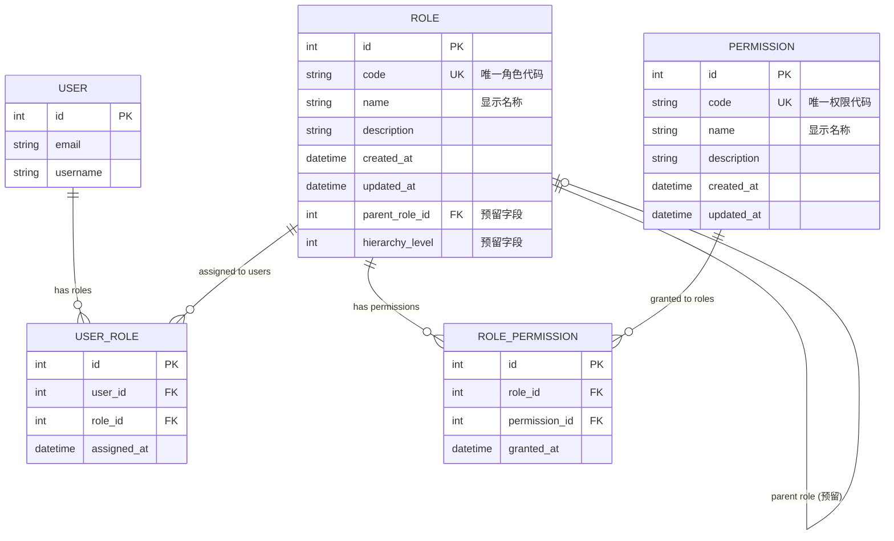

# Role-Based Access Control Bundle 技术设计文档

## 概述

本文档详细描述了 Role-Based Access Control Bundle 的技术架构设计，基于已完成的需求规格说明书，为后续实现提供详细的技术指导。

## 架构概览

### 核心设计原则

1. **KISS原则**：保持简洁，避免过度设计
2. **Symfony原生集成**：完全复用 Security 组件
3. **幂等性**：所有写操作都实现幂等性
4. **性能优化**：单查询获取用户权限，支持批量操作
5. **可扩展性**：预留关键扩展点

### 技术栈

- **PHP 8.1+**
- **Symfony 6.4+**
- **Doctrine ORM 2.15+**
- **PHPUnit 9.0+**
- **PHPStan Level 8**

### 技术决策理由

1. **选择Symfony Security集成**：复用成熟的权限检查机制，避免重复造轮子
2. **硬删除策略**：简化数据模型，通过前置检查保证数据完整性
3. **扁平权限结构**：避免复杂的角色继承，预留扩展点供未来升级
4. **分散权限维护**：各Bundle自管权限码，通过命名规范避免冲突

## 公共API设计

### 核心接口定义

#### PermissionManagerInterface
包的主要公共接口，提供所有权限管理功能：

```php
<?php

namespace Tourze\RoleBasedAccessControlBundle\Service;

use Symfony\Component\Security\Core\User\UserInterface;

interface PermissionManagerInterface
{
    /**
     * 为用户分配角色（幂等操作）
     * @param UserInterface $user 目标用户
     * @param string $roleCode 角色代码
     * @return bool 是否发生了变更
     * @throws \InvalidArgumentException 角色不存在时
     */
    public function assignRoleToUser(UserInterface $user, string $roleCode): bool;

    /**
     * 从用户撤销角色（幂等操作）
     * @param UserInterface $user 目标用户
     * @param string $roleCode 角色代码
     * @return bool 是否发生了变更
     */
    public function revokeRoleFromUser(UserInterface $user, string $roleCode): bool;

    /**
     * 为角色添加权限（幂等操作）
     * @param string $roleCode 角色代码
     * @param string $permissionCode 权限代码
     * @return bool 是否发生了变更
     * @throws \InvalidArgumentException 角色或权限不存在时
     */
    public function addPermissionToRole(string $roleCode, string $permissionCode): bool;

    /**
     * 从角色移除权限（幂等操作）
     * @param string $roleCode 角色代码
     * @param string $permissionCode 权限代码
     * @return bool 是否发生了变更
     */
    public function removePermissionFromRole(string $roleCode, string $permissionCode): bool;

    /**
     * 获取用户的所有权限（优化的单查询）
     * @param UserInterface $user 目标用户
     * @return array<string> 权限代码数组
     */
    public function getUserPermissions(UserInterface $user): array;

    /**
     * 检查用户是否具有指定权限
     * @param UserInterface $user 目标用户
     * @param string $permissionCode 权限代码
     * @return bool
     */
    public function hasPermission(UserInterface $user, string $permissionCode): bool;

    /**
     * 获取用户的所有角色
     * @param UserInterface $user 目标用户
     * @return array<Role> 角色实体数组
     */
    public function getUserRoles(UserInterface $user): array;

    /**
     * 检查角色是否可以删除
     * @param string $roleCode 角色代码
     * @return bool
     */
    public function canDeleteRole(string $roleCode): bool;

    /**
     * 检查权限是否可以删除
     * @param string $permissionCode 权限代码
     * @return bool
     */
    public function canDeletePermission(string $permissionCode): bool;

    /**
     * 删除角色（硬删除，带前置检查）
     * @param string $roleCode 角色代码
     * @throws \RuntimeException 存在关联时
     */
    public function deleteRole(string $roleCode): void;

    /**
     * 删除权限（硬删除，带前置检查）
     * @param string $permissionCode 权限代码
     * @throws \RuntimeException 存在关联时
     */
    public function deletePermission(string $permissionCode): void;

    /**
     * 批量分配角色
     * @param array<string, array<string>> $userRoleMapping 用户ID => 角色代码数组
     * @return BulkOperationResult
     */
    public function bulkAssignRoles(array $userRoleMapping): BulkOperationResult;

    /**
     * 批量撤销角色
     * @param array<string, array<string>> $userRoleMapping 用户ID => 角色代码数组
     * @return BulkOperationResult
     */
    public function bulkRevokeRoles(array $userRoleMapping): BulkOperationResult;

    /**
     * 批量授予权限
     * @param array<string, array<string>> $rolePermissionMapping 角色代码 => 权限代码数组
     * @return BulkOperationResult
     */
    public function bulkGrantPermissions(array $rolePermissionMapping): BulkOperationResult;
}
```

#### BulkOperationResult
批量操作结果封装：

```php
<?php

namespace Tourze\RoleBasedAccessControlBundle\Service;

class BulkOperationResult
{
    /**
     * @param int $successCount 成功数量
     * @param int $failureCount 失败数量
     * @param array<array{item: mixed, error: string}> $failures 失败详情
     */
    public function __construct(
        private readonly int $successCount,
        private readonly int $failureCount,
        private readonly array $failures = []
    ) {}

    public function getSuccessCount(): int
    {
        return $this->successCount;
    }

    public function getFailureCount(): int
    {
        return $this->failureCount;
    }

    /**
     * @return array<array{item: mixed, error: string}>
     */
    public function getFailures(): array
    {
        return $this->failures;
    }

    public function isFullSuccess(): bool
    {
        return $this->failureCount === 0;
    }

    public function getTotalCount(): int
    {
        return $this->successCount + $this->failureCount;
    }
}
```

#### AuditLoggerInterface
审计日志接口：

```php
<?php

namespace Tourze\RoleBasedAccessControlBundle\Service;

use Symfony\Component\Security\Core\User\UserInterface;

interface AuditLoggerInterface
{
    /**
     * 记录权限变更操作
     * @param string $action 操作类型
     * @param array<string, mixed> $data 操作数据
     */
    public function logPermissionChange(string $action, array $data): void;

    /**
     * 记录权限检查操作
     * @param string $permissionCode 权限代码
     * @param UserInterface $user 用户
     * @param bool $result 检查结果
     */
    public function logPermissionCheck(string $permissionCode, UserInterface $user, bool $result): void;

    /**
     * 生成唯一操作ID
     * @return string
     */
    public function generateOperationId(): string;
}
```

### 使用示例代码

#### 基础权限检查
```php
// Controller中使用Symfony原生注解
#[IsGranted('PERMISSION_USER_EDIT')]
public function editUser(): Response
{
    // 权限检查通过，执行业务逻辑
    return new Response('User edited successfully');
}

// Service中使用权限检查
class UserService
{
    public function __construct(
        private readonly Security $security,
        private readonly PermissionManagerInterface $permissionManager
    ) {}

    public function updateUser(User $user, array $data): void
    {
        if (!$this->security->isGranted('PERMISSION_USER_EDIT')) {
            throw new AccessDeniedException('Permission denied');
        }
        
        // 或者直接使用PermissionManager
        if (!$this->permissionManager->hasPermission($this->security->getUser(), 'PERMISSION_USER_EDIT')) {
            throw new AccessDeniedException('Permission denied');
        }
        
        // 执行更新操作
    }
}
```

#### 权限管理操作
```php
class RoleManagementService  
{
    public function __construct(
        private readonly PermissionManagerInterface $permissionManager
    ) {}

    public function assignEditorRole(User $user): void
    {
        // 幂等操作，重复调用不会出错
        $changed = $this->permissionManager->assignRoleToUser($user, 'ROLE_EDITOR');
        
        if ($changed) {
            // 处理角色变更的后续逻辑
            $this->logger->info('Role assigned', ['user_id' => $user->getId()]);
        }
    }

    public function setupEditorRole(): void
    {
        // 为编辑者角色添加权限
        $this->permissionManager->addPermissionToRole('ROLE_EDITOR', 'PERMISSION_ARTICLE_EDIT');
        $this->permissionManager->addPermissionToRole('ROLE_EDITOR', 'PERMISSION_ARTICLE_CREATE');
        $this->permissionManager->addPermissionToRole('ROLE_EDITOR', 'PERMISSION_ARTICLE_DELETE');
    }
}
```

#### 批量操作
```php
class BulkPermissionService
{
    public function __construct(
        private readonly PermissionManagerInterface $permissionManager
    ) {}

    public function assignRolesToNewEmployees(array $userIds, string $roleCode): BulkOperationResult
    {
        $mapping = [];
        foreach ($userIds as $userId) {
            $mapping[$userId] = [$roleCode];
        }

        $result = $this->permissionManager->bulkAssignRoles($mapping);

        // 处理批量操作结果
        if (!$result->isFullSuccess()) {
            foreach ($result->getFailures() as $failure) {
                $this->logger->warning('Role assignment failed', [
                    'user_id' => $failure['item'],
                    'error' => $failure['error']
                ]);
            }
        }

        return $result;
    }
}
```

### 错误处理策略

#### 异常类型
```php
// 权限不存在
class PermissionNotFoundException extends \InvalidArgumentException {}

// 角色不存在  
class RoleNotFoundException extends \InvalidArgumentException {}

// 删除冲突
class DeletionConflictException extends \RuntimeException {}

// 批量操作部分失败
class PartialBulkOperationException extends \RuntimeException {}
```

#### 错误处理示例
```php
try {
    $this->permissionManager->assignRoleToUser($user, 'INVALID_ROLE');
} catch (RoleNotFoundException $e) {
    // 处理角色不存在的情况
    $this->logger->error('Invalid role assignment attempt', [
        'role_code' => 'INVALID_ROLE',
        'user_id' => $user->getId()
    ]);
    throw new \InvalidArgumentException('指定的角色不存在');
}

try {
    $this->permissionManager->deleteRole('ROLE_ADMIN');
} catch (DeletionConflictException $e) {
    // 处理删除冲突
    return new JsonResponse([
        'error' => '无法删除角色',
        'reason' => '该角色仍被用户使用',
        'affected_users' => $e->getAffectedEntities()
    ], 409);
}
```

## 内部架构

### 核心组件划分

```
src/
├── Entity/                 # 贫血模型实体
│   ├── Role.php           # 角色实体
│   ├── Permission.php     # 权限实体
│   └── UserRole.php       # 用户-角色关联实体
├── Repository/            # 数据访问层
│   ├── RoleRepository.php
│   ├── PermissionRepository.php
│   └── UserRoleRepository.php
├── Service/               # 业务逻辑层（扁平化）
│   ├── PermissionManager.php          # 主要业务服务
│   ├── PermissionVoter.php           # Symfony Security Voter
│   ├── AuditLogger.php               # 审计日志服务
│   └── PermissionScannerService.php  # 权限码扫描服务
├── Command/               # CLI命令
│   ├── RoleCommand.php
│   ├── PermissionCommand.php
│   ├── GrantCommand.php
│   ├── RevokeCommand.php
│   ├── BulkCommand.php
│   └── ScanCommand.php
├── Event/                 # 事件类
│   ├── RoleAssignedToUserEvent.php
│   ├── PermissionAddedToRoleEvent.php
│   └── PermissionRevokedFromRoleEvent.php
└── DependencyInjection/   # Bundle配置
    └── RoleBasedAccessControlExtension.php
```

### 内部类图



### 数据流设计

#### 权限检查流程


#### 权限分配流程


### 数据库模型设计

#### 实体关系图


#### 索引策略
```sql
-- 唯一约束
CREATE UNIQUE INDEX role_code_unique ON role(code);
CREATE UNIQUE INDEX permission_code_unique ON permission(code);

-- 复合唯一索引
CREATE UNIQUE INDEX user_role_unique ON user_role(user_id, role_id);
CREATE UNIQUE INDEX role_permission_unique ON role_permission(role_id, permission_id);

-- 性能优化索引
CREATE INDEX user_role_user_id_idx ON user_role(user_id);
CREATE INDEX user_role_role_id_idx ON user_role(role_id);
CREATE INDEX role_permission_role_id_idx ON role_permission(role_id);
CREATE INDEX role_permission_permission_id_idx ON role_permission(permission_id);

-- 时间戳索引（便于审计查询）
CREATE INDEX role_created_at_idx ON role(created_at);
CREATE INDEX permission_created_at_idx ON permission(created_at);
CREATE INDEX user_role_assigned_at_idx ON user_role(assigned_at);
```

## 扩展机制

### 事件系统设计

#### 核心事件类

```php
<?php

namespace Tourze\RoleBasedAccessControlBundle\Event;

use Symfony\Component\Security\Core\User\UserInterface;
use Symfony\Contracts\EventDispatcher\Event;

class RoleAssignedToUserEvent extends Event
{
    public const NAME = 'rbac.role.assigned';

    public function __construct(
        private readonly UserInterface $user,
        private readonly Role $role,
        private readonly \DateTimeImmutable $occurredAt,
        private readonly ?UserInterface $operatedBy = null,
        private readonly string $operationId = '',
        private readonly array $context = []
    ) {}

    public function getUser(): UserInterface
    {
        return $this->user;
    }

    public function getRole(): Role
    {
        return $this->role;
    }

    public function getOccurredAt(): \DateTimeImmutable
    {
        return $this->occurredAt;
    }

    public function getOperatedBy(): ?UserInterface
    {
        return $this->operatedBy;
    }

    public function getOperationId(): string
    {
        return $this->operationId;
    }

    public function getContext(): array
    {
        return $this->context;
    }
}

class PermissionAddedToRoleEvent extends Event
{
    public const NAME = 'rbac.permission.added';

    // 类似的结构...
}

class PermissionRevokedFromRoleEvent extends Event
{
    public const NAME = 'rbac.permission.revoked';

    // 类似的结构...
}
```

#### 事件监听器示例

```php
<?php

namespace Tourze\RoleBasedAccessControlBundle\EventListener;

use Tourze\RoleBasedAccessControlBundle\Event\RoleAssignedToUserEvent;
use Psr\Log\LoggerInterface;
use Symfony\Component\EventDispatcher\Attribute\AsEventListener;

#[AsEventListener(event: RoleAssignedToUserEvent::NAME)]
class PermissionAuditListener
{
    public function __construct(
        private readonly LoggerInterface $logger
    ) {}

    public function onRoleAssigned(RoleAssignedToUserEvent $event): void
    {
        // 结构化日志记录
        $this->logger->info('role.assigned', [
            'operation_id' => $event->getOperationId(),
            'user_id' => method_exists($event->getUser(), 'getId') ? $event->getUser()->getId() : 'anonymous',
            'role_code' => $event->getRole()->getCode(),
            'operated_by' => $event->getOperatedBy()?->getId(),
            'occurred_at' => $event->getOccurredAt()->format('c'),
            'context' => $event->getContext()
        ]);
    }
}
```

### 配置架构

遵循**不创建Configuration类**的原则，所有配置通过环境变量读取：

```php
<?php

namespace Tourze\RoleBasedAccessControlBundle\Service;

class PermissionManager implements PermissionManagerInterface
{
    private readonly bool $auditEnabled;
    private readonly string $logLevel;
    private readonly int $bulkOperationBatchSize;

    public function __construct(
        private readonly EntityManagerInterface $entityManager,
        // ... 其他依赖
    ) {
        // 直接从环境变量读取配置
        $this->auditEnabled = (bool) ($_ENV['RBAC_AUDIT_ENABLED'] ?? true);
        $this->logLevel = $_ENV['RBAC_LOG_LEVEL'] ?? 'info';
        $this->bulkOperationBatchSize = (int) ($_ENV['RBAC_BULK_BATCH_SIZE'] ?? 100);
    }

    // ... 业务方法
}
```

#### 支持的环境变量

```bash
# 审计配置
RBAC_AUDIT_ENABLED=true          # 是否启用审计日志
RBAC_LOG_LEVEL=info              # 日志级别：debug, info, warning, error

# 性能配置
RBAC_BULK_BATCH_SIZE=100         # 批量操作批次大小
RBAC_CACHE_TTL=3600              # 缓存TTL（秒）
RBAC_MAX_PERMISSIONS_PER_ROLE=50 # 每个角色最大权限数

# Voter配置
RBAC_VOTER_PRIORITY=0            # Voter优先级
RBAC_VOTER_STRICT_MODE=false     # 严格模式（未知权限返回DENIED）

# CLI配置
RBAC_CLI_PROGRESS_BAR=true       # 是否显示进度条
RBAC_CLI_VERBOSE_DEFAULT=false   # 默认是否启用详细输出
```

### 扩展点定义

#### 自定义权限检查策略
```php
<?php

namespace Tourze\RoleBasedAccessControlBundle\Service;

interface PermissionCheckStrategyInterface
{
    public function canExecute(UserInterface $user, string $permissionCode, mixed $subject = null): bool;
}

// 预留扩展点，支持对象级权限
class ObjectLevelPermissionStrategy implements PermissionCheckStrategyInterface
{
    public function canExecute(UserInterface $user, string $permissionCode, mixed $subject = null): bool
    {
        // 未来实现对象级权限检查逻辑
        return false;
    }
}
```

#### 自定义审计策略
```php
<?php

namespace Tourze\RoleBasedAccessControlBundle\Service;

interface AuditStrategyInterface
{
    public function shouldAudit(string $action, array $data): bool;
    public function formatAuditData(string $action, array $data): array;
}

class SensitivePermissionAuditStrategy implements AuditStrategyInterface
{
    private const SENSITIVE_PERMISSIONS = [
        'PERMISSION_SYSTEM_ADMIN',
        'PERMISSION_USER_DELETE',
        'PERMISSION_FINANCIAL_VIEW'
    ];

    public function shouldAudit(string $action, array $data): bool
    {
        // 敏感权限操作必须审计
        if (isset($data['permission_code'])) {
            return in_array($data['permission_code'], self::SENSITIVE_PERMISSIONS);
        }
        
        return false;
    }

    public function formatAuditData(string $action, array $data): array
    {
        // 增加额外的审计字段
        return array_merge($data, [
            'audit_level' => 'high',
            'requires_review' => true,
            'notification_required' => true
        ]);
    }
}
```

## 集成设计

### Symfony集成（Bundle）

#### Bundle类定义
```php
<?php

namespace Tourze\RoleBasedAccessControlBundle;

use Symfony\Component\HttpKernel\Bundle\Bundle;

class RoleBasedAccessControlBundle extends Bundle
{
    public function getPath(): string
    {
        return \dirname(__DIR__);
    }
}
```

#### 服务注册扩展
```php
<?php

namespace Tourze\RoleBasedAccessControlBundle\DependencyInjection;

use Symfony\Component\DependencyInjection\ContainerBuilder;
use Symfony\Component\DependencyInjection\Extension\Extension;
use Symfony\Component\DependencyInjection\Loader\PhpFileLoader;
use Symfony\Component\Config\FileLocator;

class RoleBasedAccessControlExtension extends Extension
{
    public function load(array $configs, ContainerBuilder $container): void
    {
        $loader = new PhpFileLoader(
            $container,
            new FileLocator(__DIR__ . '/../Resources/config')
        );
        
        $loader->load('services.php');
    }
}
```

#### 服务配置文件
```php
<?php
// Resources/config/services.php

use Tourze\RoleBasedAccessControlBundle\Service\PermissionManager;
use Tourze\RoleBasedAccessControlBundle\Service\PermissionVoter;
use Tourze\RoleBasedAccessControlBundle\Service\AuditLogger;
use Symfony\Component\DependencyInjection\Loader\Configurator\ContainerConfigurator;

return static function (ContainerConfigurator $containerConfigurator): void {
    $services = $containerConfigurator->services();

    // 主要服务
    $services->set(PermissionManager::class)
        ->autowire()
        ->autoconfigure()
        ->alias('rbac.permission_manager', PermissionManager::class);

    // Voter服务（自动注册到Security）
    $services->set(PermissionVoter::class)
        ->autowire()
        ->tag('security.voter', ['priority' => (int) ($_ENV['RBAC_VOTER_PRIORITY'] ?? 0)]);

    // 审计日志服务
    $services->set(AuditLogger::class)
        ->autowire()
        ->autoconfigure();

    // Repository服务
    $services->set(Tourze\RoleBasedAccessControlBundle\Repository\RoleRepository::class)
        ->autowire()
        ->tag('doctrine.repository_service');

    $services->set(Tourze\RoleBasedAccessControlBundle\Repository\PermissionRepository::class)
        ->autowire()
        ->tag('doctrine.repository_service');

    $services->set(Tourze\RoleBasedAccessControlBundle\Repository\UserRoleRepository::class)
        ->autowire()
        ->tag('doctrine.repository_service');

    // Console命令自动注册
    $services->load('Tourze\\RoleBasedAccessControlBundle\\Command\\', '../../../Command/')
        ->autowire()
        ->autoconfigure()
        ->tag('console.command');
};
```

### 使用方指南

#### 1. Bundle安装
```bash
# 1. 安装包
composer require tourze/role-based-access-control-bundle

# 2. 注册Bundle
# config/bundles.php
return [
    // ... 其他bundles
    Tourze\RoleBasedAccessControlBundle\RoleBasedAccessControlBundle::class => ['all' => true],
];

# 3. 配置环境变量
# .env
RBAC_AUDIT_ENABLED=true
RBAC_LOG_LEVEL=info
RBAC_VOTER_PRIORITY=0
```

#### 2. 数据库配置
```yaml
# doctrine.yaml (仅配置实体路径，不创建migration)
doctrine:
    orm:
        mappings:
            RoleBasedAccessControlBundle:
                is_bundle: true
                type: attribute
                dir: 'Entity'
                prefix: 'Tourze\RoleBasedAccessControlBundle\Entity'
                alias: RBAC
```

#### 3. 创建数据库表
```sql
-- 用户需要手动执行或在migration中创建表
-- 参考SQL schema（包提供模板）

CREATE TABLE rbac_role (
    id INT AUTO_INCREMENT PRIMARY KEY,
    code VARCHAR(255) NOT NULL UNIQUE,
    name VARCHAR(255) NOT NULL,
    description TEXT,
    parent_role_id INT NULL,
    hierarchy_level INT NULL DEFAULT 0,
    created_at DATETIME NOT NULL,
    updated_at DATETIME NOT NULL,
    INDEX parent_role_idx (parent_role_id)
);

CREATE TABLE rbac_permission (
    id INT AUTO_INCREMENT PRIMARY KEY,
    code VARCHAR(255) NOT NULL UNIQUE,
    name VARCHAR(255) NOT NULL,
    description TEXT,
    created_at DATETIME NOT NULL,
    updated_at DATETIME NOT NULL
);

-- 其他表...
```

#### 4. 基础数据初始化
```php
<?php
// 在DataFixtures或Command中初始化基础角色和权限

class RbacDataFixtures extends Fixture
{
    public function __construct(
        private readonly PermissionManagerInterface $permissionManager
    ) {}

    public function load(ObjectManager $manager): void
    {
        // 创建基础角色
        $adminRole = new Role();
        $adminRole->setCode('ROLE_ADMIN');
        $adminRole->setName('系统管理员');
        $adminRole->setDescription('拥有所有权限的系统管理员');
        $manager->persist($adminRole);

        // 创建基础权限
        $userEditPermission = new Permission();
        $userEditPermission->setCode('PERMISSION_USER_EDIT');
        $userEditPermission->setName('编辑用户');
        $userEditPermission->setDescription('编辑用户基本信息');
        $manager->persist($userEditPermission);

        $manager->flush();

        // 分配权限到角色
        $this->permissionManager->addPermissionToRole('ROLE_ADMIN', 'PERMISSION_USER_EDIT');
    }
}
```

### 独立使用支持

虽然主要为Symfony设计，但核心Service可以独立使用：

```php
<?php
// 独立使用示例

use Tourze\RoleBasedAccessControlBundle\Service\PermissionManager;
use Doctrine\ORM\EntityManagerInterface;

// 手动创建服务实例
$permissionManager = new PermissionManager(
    $entityManager,
    $roleRepository,
    $permissionRepository,
    $userRoleRepository,
    $eventDispatcher, // 可选
    $auditLogger      // 可选
);

// 使用相同的API
$hasPermission = $permissionManager->hasPermission($user, 'PERMISSION_USER_EDIT');
```

## 测试策略

### 单元测试方案

#### 测试结构
```
tests/
├── Unit/
│   ├── Service/
│   │   ├── PermissionManagerTest.php    # 核心业务逻辑测试
│   │   ├── PermissionVoterTest.php      # Voter逻辑测试
│   │   └── AuditLoggerTest.php          # 审计日志测试
│   ├── Entity/
│   │   ├── RoleTest.php                 # 实体测试
│   │   ├── PermissionTest.php
│   │   └── UserRoleTest.php
│   └── Repository/
│       ├── RoleRepositoryTest.php       # Repository测试
│       ├── PermissionRepositoryTest.php
│       └── UserRoleRepositoryTest.php
├── Integration/
│   ├── SymfonySecurityIntegrationTest.php  # Security集成测试
│   ├── EventDispatcherIntegrationTest.php  # 事件系统测试
│   └── DatabaseIntegrationTest.php         # 数据库集成测试
├── Functional/
│   ├── PermissionCheckFlowTest.php         # 完整权限检查流程测试
│   ├── BulkOperationTest.php               # 批量操作测试
│   └── AuditTrailTest.php                  # 审计追踪测试
└── Command/
    ├── RoleCommandTest.php                 # CLI命令测试
    ├── PermissionCommandTest.php
    └── BulkCommandTest.php
```

#### 核心测试用例

```php
<?php

namespace Tourze\RoleBasedAccessControlBundle\Tests\Service;

use PHPUnit\Framework\TestCase;
use Tourze\RoleBasedAccessControlBundle\Service\PermissionManager;
use Symfony\Component\Security\Core\User\UserInterface;

class PermissionManagerTest extends TestCase
{
    private PermissionManager $permissionManager;
    private UserInterface $user;

    protected function setUp(): void
    {
        // Mock所有依赖
        $entityManager = $this->createMock(EntityManagerInterface::class);
        $roleRepository = $this->createMock(RoleRepository::class);
        // ... 其他mock

        $this->permissionManager = new PermissionManager(
            $entityManager,
            $roleRepository,
            $permissionRepository,
            $userRoleRepository,
            $eventDispatcher,
            $auditLogger
        );

        $this->user = $this->createMock(UserInterface::class);
    }

    public function testAssignRoleToUserWhenRoleExists(): void
    {
        // 测试：角色存在时分配成功
        $roleCode = 'ROLE_EDITOR';
        
        // 配置mock行为
        $role = new Role();
        $role->setCode($roleCode);
        
        $this->roleRepository
            ->method('findOneByCode')
            ->with($roleCode)
            ->willReturn($role);

        // 执行测试
        $result = $this->permissionManager->assignRoleToUser($this->user, $roleCode);

        // 断言结果
        $this->assertTrue($result); // 应该返回true表示发生了变更
    }

    public function testAssignRoleToUserWhenRoleNotExists(): void
    {
        // 测试：角色不存在时抛出异常
        $roleCode = 'INVALID_ROLE';
        
        $this->roleRepository
            ->method('findOneByCode')
            ->with($roleCode)
            ->willReturn(null);

        // 断言异常
        $this->expectException(RoleNotFoundException::class);
        $this->expectExceptionMessage("Role '{$roleCode}' not found");

        $this->permissionManager->assignRoleToUser($this->user, $roleCode);
    }

    public function testAssignRoleToUserWhenAlreadyAssigned(): void
    {
        // 测试：用户已有角色时的幂等性
        $roleCode = 'ROLE_EDITOR';
        
        // 用户已有该角色
        $this->userRoleRepository
            ->method('findOneBy')
            ->willReturn(new UserRole()); // 存在记录

        $result = $this->permissionManager->assignRoleToUser($this->user, $roleCode);

        // 断言：没有发生变更
        $this->assertFalse($result);
    }

    public function testGetUserPermissionsReturnsCorrectPermissions(): void
    {
        // 测试：获取用户权限返回正确结果
        $expectedPermissions = ['PERMISSION_USER_EDIT', 'PERMISSION_USER_VIEW'];
        
        $this->userRoleRepository
            ->method('getUserPermissions')
            ->with($this->user)
            ->willReturn($expectedPermissions);

        $result = $this->permissionManager->getUserPermissions($this->user);

        $this->assertSame($expectedPermissions, $result);
    }

    public function testHasPermissionReturnsTrueWhenUserHasPermission(): void
    {
        // 测试：用户有权限时返回true
        $permission = 'PERMISSION_USER_EDIT';
        $userPermissions = ['PERMISSION_USER_EDIT', 'PERMISSION_USER_VIEW'];
        
        $this->userRoleRepository
            ->method('getUserPermissions')
            ->willReturn($userPermissions);

        $result = $this->permissionManager->hasPermission($this->user, $permission);

        $this->assertTrue($result);
    }

    public function testHasPermissionReturnsFalseWhenUserDoesNotHavePermission(): void
    {
        // 测试：用户没有权限时返回false
        $permission = 'PERMISSION_USER_DELETE';
        $userPermissions = ['PERMISSION_USER_EDIT', 'PERMISSION_USER_VIEW'];
        
        $this->userRoleRepository
            ->method('getUserPermissions')
            ->willReturn($userPermissions);

        $result = $this->permissionManager->hasPermission($this->user, $permission);

        $this->assertFalse($result);
    }

    public function testBulkAssignRolesHandlesPartialFailures(): void
    {
        // 测试：批量分配处理部分失败
        $mapping = [
            'user1' => ['ROLE_EDITOR'],
            'user2' => ['INVALID_ROLE'],  // 这个会失败
            'user3' => ['ROLE_VIEWER']
        ];

        $result = $this->permissionManager->bulkAssignRoles($mapping);

        $this->assertSame(2, $result->getSuccessCount());
        $this->assertSame(1, $result->getFailureCount());
        $this->assertFalse($result->isFullSuccess());
        $this->assertCount(1, $result->getFailures());
    }

    public function testCanDeleteRoleReturnsFalseWhenRoleHasUsers(): void
    {
        // 测试：角色有用户时不能删除
        $roleCode = 'ROLE_EDITOR';
        
        $this->userRoleRepository
            ->method('countByRole')
            ->with($roleCode)
            ->willReturn(5); // 5个用户使用此角色

        $result = $this->permissionManager->canDeleteRole($roleCode);

        $this->assertFalse($result);
    }

    public function testDeleteRoleThrowsExceptionWhenCannotDelete(): void
    {
        // 测试：不能删除时抛出异常
        $roleCode = 'ROLE_EDITOR';
        
        // Mock canDeleteRole返回false
        $this->userRoleRepository
            ->method('countByRole')
            ->willReturn(3);

        $this->expectException(DeletionConflictException::class);
        $this->expectExceptionMessage("Cannot delete role 'ROLE_EDITOR': 3 users are assigned to this role");

        $this->permissionManager->deleteRole($roleCode);
    }
}
```

### 集成测试方案

#### Symfony Security集成测试
```php
<?php

namespace Tourze\RoleBasedAccessControlBundle\Tests\Integration;

use Symfony\Bundle\FrameworkBundle\Test\KernelTestCase;
use Symfony\Component\Security\Core\Authorization\AuthorizationCheckerInterface;
use Symfony\Component\Security\Core\Authentication\Token\UsernamePasswordToken;
use Symfony\Component\Security\Core\Authentication\Token\Storage\TokenStorageInterface;

class SymfonySecurityIntegrationTest extends KernelTestCase
{
    private AuthorizationCheckerInterface $authorizationChecker;
    private TokenStorageInterface $tokenStorage;

    protected function setUp(): void
    {
        self::bootKernel();
        
        $this->authorizationChecker = static::getContainer()->get(AuthorizationCheckerInterface::class);
        $this->tokenStorage = static::getContainer()->get(TokenStorageInterface::class);
    }

    public function testIsGrantedWorksWithPermissionVoter(): void
    {
        // 创建测试用户和权限
        $user = $this->createTestUserWithPermissions(['PERMISSION_USER_EDIT']);
        
        // 设置认证token
        $token = new UsernamePasswordToken($user, 'test', ['ROLE_USER']);
        $this->tokenStorage->setToken($token);

        // 测试isGranted方法
        $this->assertTrue($this->authorizationChecker->isGranted('PERMISSION_USER_EDIT'));
        $this->assertFalse($this->authorizationChecker->isGranted('PERMISSION_USER_DELETE'));
    }

    public function testVoterAbstainsForNonPermissionAttributes(): void
    {
        // 测试Voter对非PERMISSION_*属性返回ABSTAIN
        $user = $this->createTestUser();
        $token = new UsernamePasswordToken($user, 'test', ['ROLE_USER']);
        $this->tokenStorage->setToken($token);

        // 其他类型的属性应该被其他Voter处理
        // 这里我们只测试不会干扰其他Voter
        $this->assertFalse($this->authorizationChecker->isGranted('ROLE_ADMIN')); // 应该由RoleVoter处理
    }

    public function testPermissionVoterLogsPermissionChecks(): void
    {
        // 测试权限检查被正确记录
        $user = $this->createTestUserWithPermissions(['PERMISSION_USER_VIEW']);
        $token = new UsernamePasswordToken($user, 'test', ['ROLE_USER']);
        $this->tokenStorage->setToken($token);

        // 执行权限检查
        $this->authorizationChecker->isGranted('PERMISSION_USER_VIEW');

        // 验证日志记录（通过测试专用的日志处理器）
        $logRecords = $this->getTestLogRecords();
        $this->assertCount(1, $logRecords);
        $this->assertStringContains('permission.check', $logRecords[0]['message']);
        $this->assertSame('PERMISSION_USER_VIEW', $logRecords[0]['context']['permission_code']);
        $this->assertTrue($logRecords[0]['context']['result']);
    }

    private function createTestUserWithPermissions(array $permissions): UserInterface
    {
        // 创建测试用户并分配权限的辅助方法
        // 使用PermissionManager分配权限
        $user = new TestUser('test@example.com');
        
        $permissionManager = static::getContainer()->get(PermissionManagerInterface::class);
        
        // 假设已有测试角色和权限
        foreach ($permissions as $permission) {
            $permissionManager->addPermissionToRole('ROLE_TEST', $permission);
        }
        $permissionManager->assignRoleToUser($user, 'ROLE_TEST');

        return $user;
    }
}
```

### 性能基准测试

#### 性能测试类
```php
<?php

namespace Tourze\RoleBasedAccessControlBundle\Tests\Performance;

use PHPUnit\Framework\TestCase;

class PerformanceBenchmarkTest extends TestCase
{
    /**
     * 测试权限查询性能 - 单次查询≤50ms
     */
    public function testPermissionQueryPerformance(): void
    {
        $user = $this->createTestUserWithManyRoles(10); // 10个角色，每个角色10个权限
        
        $startTime = microtime(true);
        
        $permissions = $this->permissionManager->getUserPermissions($user);
        
        $executionTime = (microtime(true) - $startTime) * 1000; // 转换为毫秒

        $this->assertLessThanOrEqual(50, $executionTime, "Permission query took {$executionTime}ms, should be ≤50ms");
        $this->assertGreaterThanOrEqual(100, count($permissions), "Should return at least 100 permissions");
    }

    /**
     * 测试批量操作性能 - 100个用户≤5秒
     */
    public function testBulkOperationPerformance(): void
    {
        $userIds = range(1, 100);
        $mapping = [];
        foreach ($userIds as $userId) {
            $mapping[(string)$userId] = ['ROLE_EDITOR'];
        }

        $startTime = microtime(true);
        
        $result = $this->permissionManager->bulkAssignRoles($mapping);
        
        $executionTime = microtime(true) - $startTime;

        $this->assertLessThanOrEqual(5, $executionTime, "Bulk operation took {$executionTime}s, should be ≤5s");
        $this->assertSame(100, $result->getSuccessCount());
    }

    /**
     * 测试内存使用 - 1000个权限≤10MB
     */
    public function testMemoryUsage(): void
    {
        $initialMemory = memory_get_usage(true);
        
        // 创建1000个权限数据
        $permissions = [];
        for ($i = 0; $i < 1000; $i++) {
            $permissions[] = "PERMISSION_TEST_{$i}";
        }

        // 模拟权限检查
        foreach ($permissions as $permission) {
            $this->permissionManager->hasPermission($this->testUser, $permission);
        }

        $memoryUsed = memory_get_usage(true) - $initialMemory;
        $memoryUsedMB = $memoryUsed / 1024 / 1024;

        $this->assertLessThanOrEqual(10, $memoryUsedMB, "Memory usage {$memoryUsedMB}MB should be ≤10MB");
    }

    /**
     * 测试并发性能 - 50个并发用户
     */
    public function testConcurrentPermissionChecks(): void
    {
        $this->markTestSkipped('Requires concurrent execution environment');
        
        // 这个测试需要在实际环境中运行，或使用专门的并发测试工具
        // 可以通过外部脚本模拟50个并发用户进行权限检查
    }

    /**
     * 测试大数据量性能 - 10万用户、1万角色、10万权限
     */
    public function testLargeDatasetPerformance(): void
    {
        $this->markTestSkipped('Requires large dataset setup');
        
        // 这个测试需要专门的大数据集环境
        // 通常在性能测试环境中单独运行
    }
}
```

### 测试覆盖率要求

根据需求文档，必须达到≥90%的代码测试覆盖率：

```xml
<!-- phpunit.xml.dist -->
<coverage>
    <report>
        <text outputFile="var/coverage.txt" showUncoveredFiles="false" showOnlySummary="true"/>
        <html outputDirectory="var/coverage/html"/>
        <clover outputFile="var/coverage/clover.xml"/>
    </report>
</coverage>
```

### 测试数据管理

```php
<?php

namespace Tourze\RoleBasedAccessControlBundle\Tests;

trait TestDataTrait
{
    protected function createTestRole(string $code = 'ROLE_TEST', string $name = 'Test Role'): Role
    {
        $role = new Role();
        $role->setCode($code);
        $role->setName($name);
        $role->setDescription('Test role for unit tests');
        $role->setCreatedAt(new \DateTime());
        $role->setUpdatedAt(new \DateTime());
        
        return $role;
    }

    protected function createTestPermission(string $code = 'PERMISSION_TEST', string $name = 'Test Permission'): Permission
    {
        $permission = new Permission();
        $permission->setCode($code);
        $permission->setName($name);
        $permission->setDescription('Test permission for unit tests');
        $permission->setCreatedAt(new \DateTime());
        $permission->setUpdatedAt(new \DateTime());
        
        return $permission;
    }

    protected function createTestUserRole(UserInterface $user, Role $role): UserRole
    {
        $userRole = new UserRole();
        $userRole->setUser($user);
        $userRole->setRole($role);
        $userRole->setAssignedAt(new \DateTime());
        
        return $userRole;
    }
}
```

<function_calls>
<invoke name="TodoWrite">
<parameter name="todos">[{"content": "\u9605\u8bfb\u67b6\u6784\u89c4\u8303\u548c\u9700\u6c42\u6587\u6863", "id": "1", "status": "completed"}, {"content": "\u8fdb\u884c\u67b6\u6784\u5408\u89c4\u6027\u68c0\u67e5", "id": "2", "status": "completed"}, {"content": "\u8bbe\u8ba1\u6280\u672f\u67b6\u6784", "id": "3", "status": "completed"}, {"content": "\u521b\u5efadesign.md\u6587\u6863", "id": "4", "status": "completed"}, {"content": "\u8bf7\u6c42\u7528\u6237\u5ba1\u6838\u548c\u6279\u51c6", "id": "5", "status": "in_progress"}]